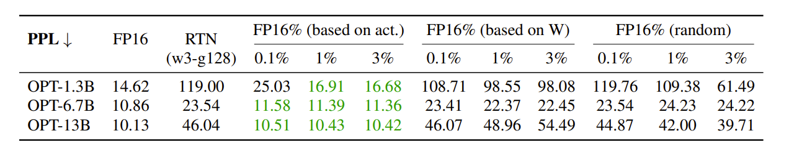
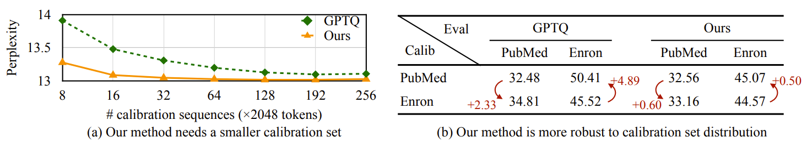
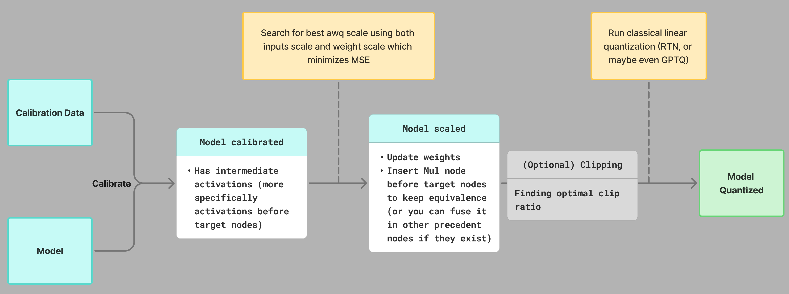

# AWQ: Activation-Aware Weight Quantization

AWQ is a weight-only quantization method (activations are kept in full precision because they serve as the "budget" traded away to protect salient weights — quantizing them too would undermine the very scaling trick that makes AWQ work) that achieves strong results through a surprisingly simple insight: **not all weights matter equally, and the ones that do can be identified by looking at activations, not weights.**

<!-- more -->

This post walks through the intuition, the math, and the tradeoffs behind AWQ. It assumes familiarity with quantization basics (many blogs exist such as [this](https://newsletter.maartengrootendorst.com/p/a-visual-guide-to-quantization), I'll be publishing an in-depth post on it soon).

## Intuition

### The Core Observation: Salient Weights

The starting point of AWQ is an empirical finding: a tiny fraction of weights (**around 0.1%-1%**) are disproportionately important for model quality. If you keep just those weights in FP16 and quantize everything else, perplexity barely moves.

The authors verified this on OPT-6.7B with INT3 quantization (group size 128):

| Method | Perplexity |
|--------|-----------|
| FP16 baseline | 10.86 |
| RTN (full quantization) | 23.54 |
| RTN + 1% salient weights in FP16 (activation-based) | 11.39 |

But how do you find which weights are "salient"? Here is where the first non-obvious insight comes in: **you should look at the activations, not the weights**. Weight channels corresponding to larger activation magnitudes are more salient because they process more important features. Selecting the top 1% by weight magnitude alone performs no better than random selection.



### The Problem with Mixed Precision

Keeping salient weights in FP16 works in theory, but it is terrible in practice. Mixed-precision formats (some channels in FP16, others in INT4) break hardware assumptions. GPUs and CPUs are designed to process uniform data types efficiently. Mixing precisions within a single matrix multiply means you cannot use optimized GEMM kernels, SIMD instructions, or tensor cores effectively.

So the question becomes: **can we protect salient weights without actually keeping them in higher precision?**
AWQ's answer is yes, through per-channel scaling.


## Theory

### Setting Up the Problem

Consider a linear layer $y = \mathbf{w}\mathbf{x}$. Under weight-only quantization, we get:

$$
\hat{y} = Q(\mathbf{w}) \cdot \mathbf{x}
$$

where the quantization function (this is a quantize→dequantize operation: weights are stored in low-bit format and then loaded and dequantized on the fly during inference) is:

$$
Q(\mathbf{w}) = \Delta \cdot \text{Round}\left(\frac{\mathbf{w}}{\Delta}\right), \quad \Delta = \frac{\max(|\mathbf{w}|)}{2^{N-1}}
$$

Here $\Delta$ is the quantization scale factor and $N$ is the number of bits (e.g. 4-bits).

#### The Scaling Trick

Now, suppose we multiply a weight element $w$ by a scaling factor $s > 1$ before quantization, and divide the corresponding input $x$ by $s$ to compensate:

$$
\hat{y} = Q(w \cdot s) \cdot \frac{x}{s}
$$

Expanding this:

$$
Q(w \cdot s) \cdot \frac{x}{s} = \Delta' \cdot \text{Round}\left(\frac{w \cdot s}{\Delta'}\right) \cdot \frac{x}{s}
$$

where $\Delta' = \frac{\max(|\mathbf{w} \cdot s|)}{2^{N-1}}$.

#### Why Does This Help?

To understand why this reduces error, the paper makes three empirical observations:

**1. Rounding error is roughly constant.** The expected error from `Round(.)` does not change regardless of the input value. Since rounding maps a float to the nearest integer, the error is approximately uniformly distributed on $[0, 0.5]$, giving an expected rounding error of about 0.25.

**2. Scaling one element rarely changes the group maximum.** When you scale up a single weight element $w$ within a group, the maximum value of the group (which determines $\Delta$) usually does not change. So $\Delta' \approx \Delta$.

**3. The scale and input are in FP16.** Both $\Delta$ and $x$ are represented in FP16, so dividing by $s$ introduces no quantization error.

Given these observations, we can write the quantization errors:

$$
\text{Err}(Q(w) \cdot x) = \Delta \cdot \text{RoundErr}\left(\frac{w}{\Delta}\right) \cdot x
$$

$$
\text{Err}\left(Q(w \cdot s) \cdot \frac{x}{s}\right) = \Delta' \cdot \text{RoundErr}\left(\frac{w \cdot s}{\Delta'}\right) \cdot \frac{x}{s}
$$

The ratio of the new error to the original is:

$$
\frac{\text{Err (scaled)}}{\text{Err (original)}} = \frac{\Delta'}{\Delta} \cdot \frac{1}{s} \approx \frac{1}{s} < 1
$$

Since $\Delta' \approx \Delta$ and $s > 1$, the quantization error for the salient weight $w$ is reduced by a factor of $s$.

That is the core trick. By scaling up a weight before quantization, you effectively give it more representation in the integer grid, reducing its relative rounding error. And by dividing the input by the same factor, you preserve the mathematical equivalence.

#### Building Intuition: What Happens Concretely

Let us trace through a concrete example to see scaling in action. Suppose we have a group of weights and we are quantizing to INT3 ($2^3=8$ levels):

```python
import numpy as np

np.random.seed(42)

# A group of 8 weights, one of which is "salient" (index 2)
weights = np.array([0.5, -0.3, 0.15, 0.8, -0.6, 0.2, -0.4, 0.7])
salient_idx = 2
x_values = np.array([0.1, 0.2, 3.5, 0.3, 0.1, 0.4, 0.2, 0.3])

n_bits = 3

def quantize_dequantize(w):
    """Fake quantize: quantize then dequantize."""
    delta = np.max(np.abs(w)) / (2 ** (n_bits - 1) - 1)
    q = np.round(w / delta)
    q = np.clip(q, -(2 ** (n_bits - 1) - 1), 2 ** (n_bits - 1) - 1)
    return q * delta, delta

# --- Without scaling ---
q_weights, delta = quantize_dequantize(weights)
y_original = weights * x_values          # true output per channel
y_quantized = q_weights * x_values       # quantized output per channel

print("=== Without scaling ===")
print(f"Delta: {delta:.4f}")
print(f"Original  w[{salient_idx}] = {weights[salient_idx]:.4f}")
print(f"Quantized w[{salient_idx}] = {q_weights[salient_idx]:.4f}")
print(f"w * x  (original) : {y_original[salient_idx]:.4f}")
print(f"w * x  (quantized): {y_quantized[salient_idx]:.4f}")
print(f"Output error      : {abs(y_original[salient_idx] - y_quantized[salient_idx]):.4f}")
print(f"Total output error (sum over all channels): "
      f"{np.sum(np.abs(y_original - y_quantized)):.4f}")

# --- With scaling (s=2 on the salient channel) ---
s = 2.0
scaled_weights = weights.copy()
scaled_weights[salient_idx] *= s

q_scaled, delta_prime = quantize_dequantize(scaled_weights)
# Undo scaling: divide quantized weight by s (equivalent to dividing input by s)
q_scaled[salient_idx] /= s
y_scaled = q_scaled * x_values

print(f"\n=== With scaling (s={s}) ===")
print(f"Delta': {delta_prime:.4f}  (changed: {not np.isclose(delta, delta_prime)})")
print(f"Original  w[{salient_idx}] = {weights[salient_idx]:.4f}")
print(f"Quantized w[{salient_idx}] = {q_scaled[salient_idx]:.4f}")
print(f"w * x  (original) : {y_original[salient_idx]:.4f}")
print(f"w * x  (quantized): {y_scaled[salient_idx]:.4f}")
print(f"Output error      : {abs(y_original[salient_idx] - y_scaled[salient_idx]):.4f}")
print(f"Total output error (sum over all channels): "
      f"{np.sum(np.abs(y_original - y_scaled)):.4f}")
```

```
=== Without scaling ===
Delta: 0.2667
Original  w[2] = 0.1500
Quantized w[2] = 0.2667
w * x  (original) : 0.5250
w * x  (quantized): 0.9333
Output error      : 0.4083
Total output error (sum over all channels): 0.6650

=== With scaling (s=2.0) ===
Delta': 0.2667  (changed: False)
Original  w[2] = 0.1500
Quantized w[2] = 0.1333
w * x  (original) : 0.5250
w * x  (quantized): 0.4667
Output error      : 0.0583
Total output error (sum over all channels): 0.3150
```

Notice three things:

1. $\Delta' = \Delta$ because scaling one small weight did not change the group maximum.

2. The output $w \cdot x$ on the salient channel went from an error of 0.4083 (the quantized output 0.9333 is almost double the true 0.5250) down to just 0.0583.

3. The total output error across all channels also dropped from 0.6650 to 0.3150, so protecting the salient channel improved the overall layer output, not just one element.

#### The Tradeoff: What Happens to Non-Salient Weights

Scaling is not free. When $s$ gets too large, $\Delta'$ starts to increase (because the scaled weight eventually becomes the new group maximum), and this hurts the non-salient channels.

Let us see this in practice:

```python
import numpy as np

np.random.seed(42)
weights = np.array([0.5, -0.3, 0.15, 0.8, -0.6, 0.2, -0.4, 0.7])
salient_idx = 2
n_bits = 3

def quantize_dequantize(w):
    delta = np.max(np.abs(w)) / (2 ** (n_bits - 1) - 1)
    q = np.round(w / delta)
    q = np.clip(q, -(2 ** (n_bits - 1) - 1), 2 ** (n_bits - 1) - 1)
    return q * delta, delta

print(f"{'s':>5} | {'delta':>8} | {'delta changed':>14} | {'salient err':>12} | {'avg other err':>14}")
print("-" * 65)

for s in [1.0, 1.25, 1.5, 2.0, 4.0, 8.0]:
    scaled = weights.copy()
    scaled[salient_idx] *= s
    q_scaled, delta_prime = quantize_dequantize(scaled)

    # Unscale the salient weight
    q_scaled[salient_idx] /= s

    salient_err = abs(weights[salient_idx] - q_scaled[salient_idx])
    other_errs = [abs(weights[i] - q_scaled[i]) for i in range(len(weights)) if i != salient_idx]
    avg_other = np.mean(other_errs)

    _, delta_orig = quantize_dequantize(weights)
    changed = "Yes" if not np.isclose(delta_orig, delta_prime) else "No"

    print(f"{s:5.2f} | {delta_prime:8.4f} | {changed:>14} | {salient_err:12.4f} | {avg_other:14.4f}")
```

```
    s |    delta |  delta changed |  salient err | avg other err
-----------------------------------------------------------------
 1.00 |   0.2667 |             No |       0.1167 |        0.0762
 1.25 |   0.2667 |             No |       0.0917 |        0.0762
 1.50 |   0.2667 |             No |       0.0667 |        0.0762
 2.00 |   0.2667 |             No |       0.0167 |        0.0762
 4.00 |   0.2667 |             No |       0.0083 |        0.0762
 8.00 |   0.4000 |            Yes |       0.0500 |        0.1143
```

At $s = 8$, the scaled weight (0.15 * 8 = 1.2) exceeds the original group maximum (0.8), so $\Delta'$ jumps from 0.2667 to 0.4. Every non-salient weight in the group now quantizes with a coarser step size, and their average error goes up. Worse, the salient weight error itself rebounds because $\Delta'/\Delta$ is no longer close to 1.

!!! note
    In the paper, the authors found that at $s = 2$, less than 5% of groups had a changed $\Delta$, and the best perplexity appeared at $s = 2$. At $s = 4$, the ratio $\Delta'/\Delta > 1$ for 21.2% of channels, which damages overall accuracy.

This is the fundamental tension in AWQ: scaling up salient weights helps them, but scaling too aggressively hurts everything else. The method needs to find the right balance.

### Searching for the Optimal Scale

Rather than picking a single scalar $s$, AWQ searches for a per-input-channel scaling vector $\mathbf{s}$ that minimizes the layer-wise reconstruction error:

$$
\mathbf{s}^* = \arg\min_{\mathbf{s}} \mathcal{L}(\mathbf{s})
$$

$$
\mathcal{L}(\mathbf{s}) = \| Q(\mathbf{W} \cdot \text{diag}(\mathbf{s}))(\text{diag}(\mathbf{s})^{-1} \cdot \mathbf{X}) - \mathbf{W}\mathbf{X} \|
$$

Here $\mathbf{W}$ is the weight matrix, $\mathbf{X}$ is the input from a small calibration set, and $Q$ is the quantization function.

#### The Search Space

The key design choice is how to parameterize $\mathbf{s}$. Since the saliency of weight channels is determined by the activation magnitudes (that is the **activation-aware** part), AWQ defines:

$$
\mathbf{s} = \mathbf{s_x}^{\alpha}, \quad \alpha^* = \arg\min_{\alpha} \mathcal{L}(\mathbf{s_x}^{\alpha})
$$

where:

- $\mathbf{s_x}$ is the average magnitude of activations per channel, computed from the calibration set
- $\alpha \in [0, 1]$ is a single hyperparameter that controls the balance

* When $\alpha = 0$, there is no scaling (all channels treated equally). 

* When $\alpha = 1$, scaling is most aggressive (channels with large activations get the most protection). 

The optimal $\alpha$ is found by a simple grid search over $[0, 1]$.

This parameterization is deliberate. It means the search space has a single dimension (just $\alpha$), making the grid search fast. In practice, the paper uses 20 grid points, so each layer requires only 20 forward passes through the quantization function.

!!! tip "Why not optimize s directly ?"
    Optimizing each element of $\mathbf{s}$ independently via backpropagation would be time-consuming and complex to implement for a post-training method. The $\alpha$ parameterization collapses this to a 1D grid search, which is both fast and stable.

#### Implementation Detail

In practice, the implementation also incorporates a weight-based scaling component. Looking at the [actual implementation](https://github.com/AyoubMDL/onnx_quantize/blob/main/src/onnx_quantize/pre_passes/awq.py), the scale at each grid point is computed as:

```python
scale = act_scale ** ratio / weight_scale ** (1 - ratio)
scale = scale / np.sqrt(np.max(scale) * np.min(scale))
```

The `weight_scale` factor accounts for the relative magnitude of each weight channel within its group, and the normalization by the geometric mean prevents the scale from drifting too far from 1. The `ratio` here plays the role of $\alpha$.

### Weight Clipping

AWQ also applies weight clipping to further reduce quantization error. This is a well-known technique in quantization: instead of using the full range $[\min(\mathbf{w}), \max(\mathbf{w})]$ to determine $\Delta$, you clip to a slightly narrower range. Clipping sacrifices the accuracy of outlier weights to improve the step size for everyone else.

What AWQ does differently from standard clipping is to consider the activation when measuring the clipping error. Standard clipping minimizes $\|Q(\mathbf{w}) - \mathbf{w}\|$, but AWQ minimizes $\|Q(\mathbf{w})\mathbf{x} - \mathbf{w}\mathbf{x}\|$. This means channels with larger activations weigh more heavily in the clipping decision, consistent with the activation-aware philosophy of the whole method.

The optimal clip ratio is found by another small grid search (10 steps in the implementation, searching over ratios from 1.0 down to 0.91).

### Why AWQ Does Not Overfit

One of AWQ's practical strengths is its minimal reliance on the calibration set. Unlike GPTQ (I'll be doing an in depth blog about it), which uses Hessian information from calibration data to perform error compensation column by column, AWQ only extracts one statistic from the calibration data: the average per-channel activation magnitude.

This distinction matters:

- **GPTQ** reconstructs weights by solving a regression problem layer by layer. It fits the quantized weights to reproduce the exact outputs on the calibration data. This is powerful but can overfit: if the calibration distribution differs from the deployment distribution, the "corrections" GPTQ learned may hurt rather than help.

- **AWQ** just measures the average channel magnitude. This is a coarse statistic that is stable across distributions. It needs as few as 16 sequences and its perplexity changes by only 0.5-0.6 points under distribution shift.

This is what the paper means by **does not rely on any regression**: AWQ does not solve a per-weight optimization problem. It does not use backpropagation. The scaling factors are derived from a simple grid search using a forward-only objective. The result is a method that generalizes well across domains, works on instruction-tuned models, and even extends to multi-modal LMs without modification.



### Results

AWQ consistently outperforms RTN (round-to-nearest) and matches or beats GPTQ across model families, sizes, and bit-widths.

| Model | FP16 | RTN (INT3-g128) | GPTQ (INT3-g128) | AWQ (INT3-g128) |
|-------|------|-----------------|------|-----|
| LLaMA-7B | 5.68 | 7.01 | 6.53 | **6.35** |
| LLaMA-13B | 5.09 | 5.88 | 5.64 | **5.52** |
| LLaMA-30B | 4.10 | 4.88 | 4.74 | **4.61** |
| LLaMA-65B | 3.53 | 4.24 | 4.21 | **3.95** |

*WikiText-2 perplexity (lower is better). INT3 quantization with group size 128.*

Notably, AWQ also generalizes to instruction-tuned models (Vicuna) and multi-modal models (OpenFlamingo, VILA), where GPTQ's calibration-sensitive approach degrades more significantly.


## Implementation

### Flow



The full AWQ pipeline for a single linear layer works as follows:

1. **Collect activation statistics**: Run a small calibration set through the model and record the average per-channel activation magnitude $\mathbf{s_x}$.

2. **Compute weight scales**: For each weight group, compute a relative weight scale indicating how large each channel is relative to the group maximum.

3. **Grid search for optimal $\alpha$**: For each candidate $\alpha$ in a grid over $[0, 1]$:
    - Compute the per-channel scaling vector $\mathbf{s} = \mathbf{s_x}^{\alpha} / \mathbf{s_w}^{(1-\alpha)}$
    - Scale the weights: $\mathbf{W'} = \mathbf{W} \cdot \text{diag}(\mathbf{s})$
    - Fake-quantize $\mathbf{W'}$ (quantize then dequantize)
    - Unscale: $\hat{\mathbf{W}} = Q(\mathbf{W'}) / \text{diag}(\mathbf{s})$
    - Measure MSE: $\mathcal{L} = \|\hat{\mathbf{W}}\mathbf{X} - \mathbf{W}\mathbf{X}\|^2$
    - Track the best scale

4. **Apply the best scale**: Multiply the weights by $\mathbf{s}^*$ and insert a corresponding $1/\mathbf{s}^*$ multiplication on the input activations (which can be fused into the previous layer's operation).

5. **(Optional) Clip search**: Search for the optimal clipping ratio that minimizes activation-weighted reconstruction error.

6. **Quantize**: Apply standard round-to-nearest quantization to the scaled weights.

### Code

I have implemented AWQ from scratch in [onnx_quantize](https://github.com/AyoubMDL/onnx_quantize), a Python package for ONNX model quantization.

The core of the implementation is in [`awq.py`](https://github.com/AyoubMDL/onnx_quantize/blob/main/src/onnx_quantize/pre_passes/awq.py). A lot of open source projects implement AWQ (such as vllm llm-compressor). Here's an example of quantizing Mistral-7b model:

[](https://colab.research.google.com/github/AyoubMDL/llm_inference_blog/blob/main/docs/blog/posts/assets/awq_llm_compressor.ipynb)

```python
# Install compressed_tensors, llm-compressor, transformers
from datasets import load_dataset
from transformers import AutoModelForCausalLM, AutoTokenizer
from llmcompressor import oneshot
from llmcompressor.modifiers.awq import AWQModifier


MODEL_ID = "mistralai/Mistral-7B-Instruct-v0.3"
model = AutoModelForCausalLM.from_pretrained(MODEL_ID, dtype="auto")
tokenizer = AutoTokenizer.from_pretrained(MODEL_ID, trust_remote_code=True)

# Select calibration dataset.
DATASET_ID = "HuggingFaceH4/ultrachat_200k"
DATASET_SPLIT = "train_sft"

# Select number of samples. 256 samples is a good place to start.
# Increasing the number of samples can improve accuracy.
NUM_CALIBRATION_SAMPLES = 256
MAX_SEQUENCE_LENGTH = 512

# Load dataset and preprocess.
ds = load_dataset(DATASET_ID, split=f"{DATASET_SPLIT}[:{NUM_CALIBRATION_SAMPLES}]")
ds = ds.shuffle(seed=42)


def preprocess(example):
    return {
        "text": tokenizer.apply_chat_template(
            example["messages"],
            tokenize=False,
        )
    }


ds = ds.map(preprocess)

# Tokenize inputs.
def tokenize(sample):
    return tokenizer(
        sample["text"],
        padding=False,
        max_length=MAX_SEQUENCE_LENGTH,
        truncation=True,
        add_special_tokens=False,
    )

# Configure the quantization algorithm to run.
recipe = [
    AWQModifier(
        ignore=["lm_head"], scheme="W4A16_ASYM", targets=["Linear"]
    ),
]

# Apply AWQ.
oneshot(
    model=model,
    dataset=ds,
    recipe=recipe,
    max_seq_length=MAX_SEQUENCE_LENGTH,
    num_calibration_samples=NUM_CALIBRATION_SAMPLES,
)

# Save to disk compressed.
SAVE_DIR = MODEL_ID.rstrip("/").split("/")[-1] + "-awq-asym"
model.save_pretrained(SAVE_DIR, save_compressed=True)
tokenizer.save_pretrained(SAVE_DIR)
```

## Summary

AWQ's strength lies in its simplicity. The entire method rests on one observation (salient weights are identified by activations) and one trick (scaling before quantization reduces error for scaled channels). There is no gradient computation, no Hessian, no regression. Just a 1D grid search per layer.

This simplicity translates to practical benefits: fast quantization, small calibration sets, robustness to distribution shift, and easy application to new model families including multi-modal architectures.

## References

- [AWQ: Activation-aware Weight Quantization for LLM Compression and Acceleration](https://arxiv.org/abs/2306.00978) - Lin et al., MLSys 2024 (Best Paper Award)
- [llmcompressor](https://github.com/vllm-project/llm-compressor/tree/main)
- [onnx_quantize: AWQ implementation](https://github.com/AyoubMDL/onnx_quantize/blob/main/src/onnx_quantize/pre_passes/awq.py)
